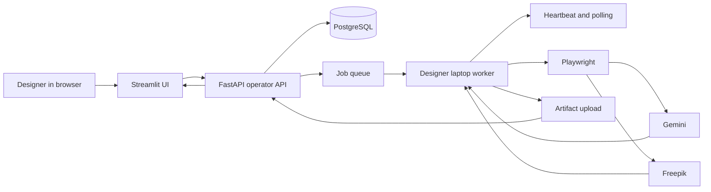

# Architecture

## Three repos

- `creative_workflow_docs_library` is the source-of-truth documentation library.
- `creative_workflow_operator` runs FastAPI, Streamlit, PostgreSQL, migrations, artifact storage, worker tokens, and local LLM orchestration.
- `creative_workflow_worker` runs on designer laptops and executes Playwright browser jobs.

```text
Operator laptop (creative_workflow_operator) <--> Designer laptop worker (creative_workflow_worker)
```

## Shared contracts

For the MVP, `creative_workflow.shared.*` is intentionally copied into both
split repos. That avoids publishing a third package before the protocol settles.

The copies must stay in lockstep. The operator repo contains
`tests/test_contracts_parity.py`, which compares Pydantic JSON schemas from the
operator and worker repos. Set `CREATIVE_WORKFLOW_WORKER_REPO` when the worker
repo is not a sibling directory:

```powershell
$env:CREATIVE_WORKFLOW_WORKER_REPO="<path-to-creative_workflow_worker>"
python -m pytest tests/test_contracts_parity.py -q
```

If the contracts diverge, update both repos in the same change.

## Runtime diagram


