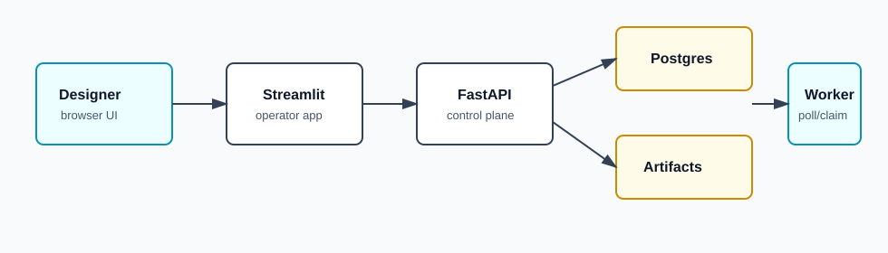

# Creative Workflow — Operator


> **Status:** pet project, actively developed, not production. Gate A is the Gemini to Freepik browser slice. Gate B adds chat-style agent routing to operator-local Ollama and worker-local Claude Code CLI/Codex CLI, then desktop bridge contracts for Photoshop and After Effects.

**Creative Workflow** is a small automation system for design agencies that work through web tools — Gemini, Freepik, Kling — instead of paid APIs. You describe a brief once; the system queues up every variation, runs the browser clicks for you across your existing accounts, and drops the results into a single dashboard you can review. One "operator" laptop runs the brain and the UI. Each designer's laptop runs a "worker" that drives their own browser sessions, so your subscriptions, cookies, and account history stay where they belong. It's a pet project, not a SaaS — built to remove the most repetitive parts of a real creative workflow without replacing the designer's judgement.

This repo is the **operator side** — the dashboard, the queue, the database, the brain.

## Three repos, one project

```text
creative-workflow-docs-library   ── specs, runbooks, prompts, skills (the design library)
creative-workflow-operator       ── runs once, on the operator laptop  ──┐
                                                                          │  jobs, heartbeats, artifacts
creative-workflow-worker         ── runs on each designer's laptop    ──┘
```

Start with this repo if you want to set up the dashboard. Designers joining an existing operator should start with [`creative-workflow-worker`](https://github.com/DanilShat/creative-workflow-worker). The docs library is read-only reference material — you don't need it to run anything.

For the Claude/browser-assisted/Photoshop/After Effects layer, start
with [`AGENT_MANIFEST.md`](AGENT_MANIFEST.md).

## What it does

- Turns one written brief into a queue of variants — color, layout, language, format — without you re-typing prompts.
- Provides a Streamlit chat console so a designer can ask the workflow agent for help while jobs run on the worker.
- Shows every job, every artifact, and every retry on a single Streamlit dashboard. No more hunting through 14 browser tabs.
- Routes routine chat to Ollama on the operator laptop and escalated browser/creative work to worker-local Claude Code or Codex CLI.
- Keeps every output, prompt, and decision in one Postgres database you can search, export, or audit later.

## Who this is for

A small creative agency or solo designer who already pays for Gemini, Freepik, or Kling subscriptions and finds themselves doing the same prompt-and-download dance dozens of times per project.

**Not for:** anyone looking for a managed SaaS or an API-first generation pipeline. This system is self-hosted and runs on Windows laptops you already own.

## Screenshots

Placeholder slots — replace with real captures once demo evidence is ready.

| | |
| --- | --- |
|  |  |
| Operator dashboard — every job, every designer, one screen. | Job detail — prompts, artifacts, retries, decisions. |


## Architecture

End-to-end data flow (operator ↔ worker ↔ creative tools), exported from **graphify**:



A narrative walkthrough of the same flow lives in [`docs/demo_walkthrough.md`](docs/demo_walkthrough.md).

## Prerequisites

- Windows 10/11
- Docker Desktop
- PowerShell 5+
- Optional: Ollama on the operator laptop for local LLM checks
- Optional on worker laptops: Claude Code CLI and Codex CLI logged into subscription accounts for agent escalation. Ollama stays on the operator laptop.

Clone anywhere. Paths in this README are relative to the repo root.

## Quick Start

Install Docker Desktop, start it, then from the repo root:

```powershell
powershell -NoProfile -ExecutionPolicy Bypass -File .\scripts\docker_operator_up.ps1 -Build
```

Open:

```text
http://127.0.0.1:8501
```

For a designer laptop on the LAN (find your IPv4 with `ipconfig | findstr IPv4`):

```powershell
powershell -NoProfile -ExecutionPolicy Bypass -File .\scripts\docker_operator_up.ps1 `
  -ServerPublicBaseUrl http://<operator-lan-ip>:8000 `
  -Build
```

Create a worker token:

```powershell
powershell -NoProfile -ExecutionPolicy Bypass -File .\scripts\docker_operator_worker_token.ps1 `
  -WorkerId designer-laptop-01
```

## Checks

```powershell
python -m pip install -e ".[test]"
python -m pytest tests -q
powershell -NoProfile -ExecutionPolicy Bypass -File .\scripts\docker_operator_status.ps1
```

The repo standardizes on `pyproject.toml`; there is no separate `requirements.txt`.

## Runtime Notes

Real secrets stay in local `.env.*` files and are ignored by git. Commit only `.env.*.example` files.

## What's next

Next work is to harden the Gate B desktop bridges with real Photoshop/After Effects validation, package the UXP panel for easier install, and add Gate C's lightweight reviewer flow so a creative director can approve or reject variants from their phone. Issues and ideas welcome - this is a personal project, so PRs are reviewed case-by-case.
