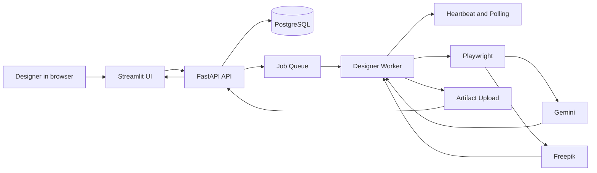

# Architecture

```mermaid
flowchart LR
    designer[Designer in browser] --> ui[Streamlit UI]
    ui --> api[FastAPI API]
    api --> pg[(PostgreSQL)]
    api --> queue[Job Queue]
    queue --> worker[Designer Worker]
    worker --> heartbeat[Heartbeat and Polling]
    worker --> pw[Playwright]
    pw --> gemini[Gemini]
    pw --> freepik[Freepik]
    gemini --> worker
    freepik --> worker
    worker --> upload[Artifact Upload]
    upload --> api
    api --> ui
```

The operator stack owns durable state, review decisions, and artifact history.
The worker owns browser execution on the designer laptop and never stores
operator secrets.
